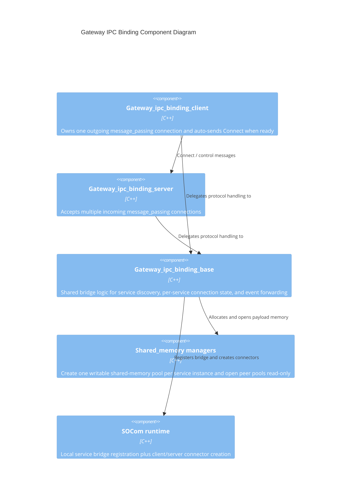

<!--
*******************************************************************************
Copyright (c) 2026 Contributors to the Eclipse Foundation

See the NOTICE file(s) distributed with this work for additional
information regarding copyright ownership.

This program and the accompanying materials are made available under the
terms of the Apache License Version 2.0 which is available at
https://www.apache.org/licenses/LICENSE-2.0

SPDX-License-Identifier: Apache-2.0
*******************************************************************************
-->

# Gateway IPC Binding

Gateway IPC Binding bridges SOCom service discovery and event transport across a local IPC link.
It combines:

- a control channel built on `score::message_passing`
- per-service shared memory segments for payload transport
- a `score::socom::Runtime` bridge registration on each side

The implementation is intentionally symmetric after the control channel is established: both peers can request services, offer services, subscribe to events, and publish event updates. In the deployed topology, `someipd` typically hosts `Gateway_ipc_binding_server` and `gatewayd` typically hosts `Gateway_ipc_binding_client`.

## Current scope

The code currently supports these flows end to end:

- initial client/server IPC connection setup
- forwarding `Request_service` and `Offer_service`
- establishing per-service bindings with `Connect_service` and `Connect_service_reply`
- propagating event subscriptions
- forwarding event updates through shared memory plus `Payload_consumed`

The message model already defines method-call related messages, but the binding does not currently dispatch them. Documentation in this directory describes the implemented behavior first and calls out the gaps explicitly.

## Architecture

`Gateway_ipc_binding_client` and `Gateway_ipc_binding_server` are thin transport adapters around the shared `Gateway_ipc_binding_base` logic.

- `Gateway_ipc_binding_client`
  - creates a single outgoing `message_passing` connection
  - starts the connection in its constructor
  - sends `Connect` automatically when the channel becomes ready
  - marks itself connected after receiving `Connect_reply`
- `Gateway_ipc_binding_server`
  - owns a `message_passing` server
  - accepts multiple incoming IPC connections
  - assigns a `Client_id` to each accepted connection
  - forwards all received control messages into the shared binding logic
- `Gateway_ipc_binding_base`
  - registers a SOCom service bridge in the local runtime
  - subscribes to local service offers and forwards them over IPC
  - tracks remote offers and local requests per service instance
  - exchanges service-specific shared-memory metadata
  - creates SOCom client or server connectors once a remote service becomes usable

## Control-plane and data-plane split

- Control-plane messages are trivially copyable structs sent directly over the IPC connection.
- Payload bytes are not copied onto the control channel. They are written into a service-specific shared-memory slot and referenced by `Shared_memory_handle`.
- The receiving side opens the sender's shared-memory pool read-only and turns the referenced slot into a SOCom payload.
- Payload lifetime is closed by `Payload_consumed`, which lets the sender release the underlying slot.

## Service binding model

The binding keeps a per-service-instance state machine keyed by service interface plus instance id.

- A local SOCom request produces `Request_service` for every connected peer.
- A local SOCom offer produces `Offer_service` for every connected peer.
- Once a service is both locally requested and remotely offered, `Connect_service` is sent.
- `Connect_service_reply` carries the peer's shared-memory metadata and method/event counts needed to build the local SOCom connector.
- Each established service mapping stores:
  - a local handle
  - a remote handle
  - local shared-memory metadata
  - remote shared-memory metadata

Those handles are used in follow-up event and payload messages instead of repeating the full service identifier.

## Known limitations

The implementation is not yet feature-complete. Important gaps to keep in mind:

- method call messages are declared, but there is no `Call_method` handling path in `Gateway_ipc_binding_base`
- `Subscribe_event_reply` and `Event_update_request` are declared, but not handled
- `subscribe_find_service_callback` registered with the SOCom bridge is still a stub with an assertion

These limitations are design constraints of the current code, not documentation omissions.

## Further details

- [shared memory](./doc/shared_memory.md)
- [IPC protocol](./doc/ipc_protocol.md)
