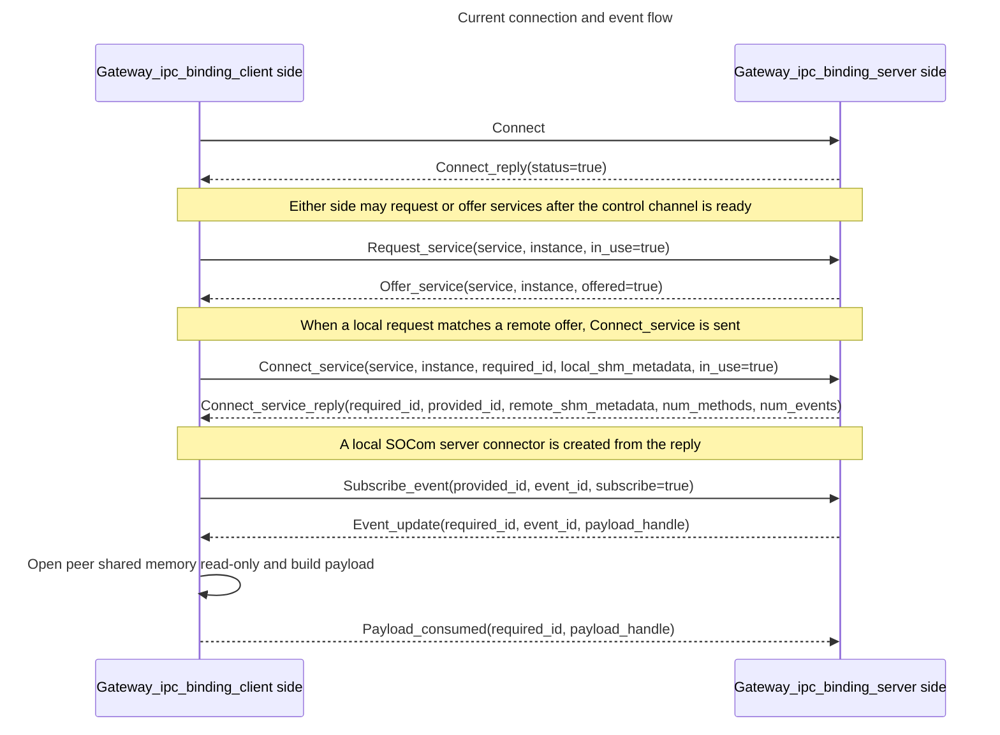

<!--
*******************************************************************************
Copyright (c) 2026 Contributors to the Eclipse Foundation

See the NOTICE file(s) distributed with this work for additional
information regarding copyright ownership.

This program and the accompanying materials are made available under the
terms of the Apache License Version 2.0 which is available at
https://www.apache.org/licenses/LICENSE-2.0

SPDX-License-Identifier: Apache-2.0
*******************************************************************************
-->

# IPC protocol

This document describes the current on-wire protocol shape and, separately, which parts are actively handled by the implementation.

## Implemented protocol phases

The binding currently implements four phases:

1. IPC connection setup
2. service discovery forwarding
3. per-service connection establishment
4. event subscription and event update forwarding

Method transport messages are defined in the public header for protocol completeness, but they are not yet dispatched by `Gateway_ipc_binding_base`.

## End-to-end flow implemented today



## Transport model

- The control channel carries fixed-layout, trivially copyable message structs.
- Payload bytes are carried out-of-band in shared memory.
- `Shared_memory_handle` identifies the slot and payload size within a peer-owned shared-memory pool.
- `Shared_memory_metadata` tells the peer how to open that shared-memory pool.

## Message layout

The implementation sends a `Message_frame<T>` over the control channel, where the first byte is the `Message_type` discriminator and the remainder is the trivially copyable payload for `T`.

The public message ids are:

- `1`: `Connect`
- `2`: `Connect_reply`
- `3`: `Request_service`
- `4`: `Offer_service`
- `5`: `Connect_service`
- `6`: `Connect_service_reply`
- `7`: `Call_method`
- `8`: `Call_method_handle`
- `9`: `Call_method_reply`
- `10`: `Cancel_method_call`
- `11`: `Subscribe_event`
- `12`: `Subscribe_event_reply`
- `13`: `Event_update`
- `14`: `Event_update_request`
- `15`: `Payload_consumed`

## Core data structures

```cpp
struct Service {
  Fixed_string<64> service_id;
  socom::Service_interface::Version version;
};

using Instance_id = Fixed_string<64>;
using Remote_handle = std::uint64_t;
using Method_invocation = std::uint64_t;

struct Shared_memory_handle {
  std::uint32_t slot_index;
  std::uint32_t used_bytes;
};

struct Shared_memory_metadata {
  Fixed_string<508> path;
  std::uint32_t slot_size;
  std::uint32_t slot_count;
};
```

## Message semantics

### `Connect`

Initial handshake message sent automatically by `Gateway_ipc_binding_client` when the underlying IPC channel reaches `kReady`.

```cpp
struct Connect {
  Fixed_size_container<Service_instance, kMax_find_service_elements> find_service_elements;
};
```

Current implementation note:

- the message is sent and parsed
- `find_service_elements` is not yet used by the server-side handler

### `Connect_reply`

Acknowledges the control-channel handshake.

```cpp
struct Connect_reply {
  bool status;
};
```

If `status` is true, the client marks itself connected and the shared binding logic may start emitting pending `Connect_service` messages.

### `Request_service`

Sent when the local SOCom runtime requests a service through the registered bridge.

```cpp
struct Request_service {
  Service service_id;
  Instance_id instance_id;
  bool in_use;
};
```

Current implementation note:

- `in_use=true` is handled
- `in_use=false` is emitted by the bridge logic, but the receive-side teardown path is still minimal

### `Offer_service`

Sent when the local runtime discovers or withdraws an offered service.

```cpp
struct Offer_service {
  Service service_id;
  Instance_id instance_id;
  bool offered;
};
```

If an offered service disappears, the implementation removes local mappings and clears pending connect state for that service key.

### `Connect_service`

Requests establishment of a service-specific binding after a local request matches a remote offer.

```cpp
struct Connect_service {
  Service service_id;
  Instance_id instance_id;
  Remote_handle required_id;
  Shared_memory_metadata metadata;
  bool in_use;
};
```

Semantics:

- `required_id` is generated by the requester and later echoed back in `Connect_service_reply`
- `metadata` describes the requester's writable shared-memory pool for this service instance
- `in_use=false` tears down the local connector and mapping for that peer/service pair

### `Connect_service_reply`

Confirms a service binding and completes the local/remote handle exchange.

```cpp
struct Connect_service_reply {
  Remote_handle required_id;
  Remote_handle provided_id;
  Shared_memory_metadata metadata;
  std::uint16_t num_methods;
  std::uint16_t num_events;
};
```

The receiver uses this to create a local SOCom server connector that represents the remote provider.

### `Subscribe_event`

Forwards local event subscription state to the peer that owns the provider-side SOCom client connector.

```cpp
struct Subscribe_event {
  Remote_handle provided_id;
  Event_id event_id;
  bool subscribe;
};
```

Current implementation note:

- this is the only active event-control message today
- there is no `Subscribe_event_reply` handling path yet

### `Event_update`

Forwards an event payload stored in the sender's shared memory.

```cpp
struct Event_update {
  Remote_handle required_id;
  Event_id event_id;
  Shared_memory_handle payload;
};
```

The receiver resolves `required_id` to peer shared-memory metadata, opens the peer pool read-only, and passes the resulting payload into the local enabled server connector.

### `Payload_consumed`

Signals that a previously received payload is no longer needed.

```cpp
struct Payload_consumed {
  Remote_handle required_id;
  Shared_memory_handle handle;
};
```

Current implementation note:

- this releases payload ownership on the sender side
- `required_id` identifies the service connection so the sender can reclaim from the correct per-service allocation table

## Declared but not implemented

The following message types exist in the public protocol header, but `Gateway_ipc_binding_base::on_receive_message()` does not handle them yet:

- `Call_method`
- `Call_method_handle`
- `Call_method_reply`
- `Cancel_method_call`
- `Subscribe_event_reply`
- `Event_update_request`

Those messages should be treated as reserved protocol surface until the corresponding binding logic is added.

### Method calls

Method calls can be fire and forget or with responses.
Method calls with responses can be cancelled.

```cpp
// method call to a method of an offered service
// receiver must respond with some identifier if not fire_forget
struct Call_method {
  Remote_handle provided_id;
  Method_id method_id;
  bool fire_and_forget;
  Shared_memory_handle payload;
};

// handle for active method call
struct Call_method_handle {
  Remote_handle required_id;
  Method_invocation invocation_id;
};

// reply to method call
struct Call_method_reply {
  Remote_handle required_id;
  Method_invocation invocation_id;
  Shared_memory_handle payload;
};
```

### Events

Events need to be subscribed to, which can fail.
After subscription event updates are received.
For field support the consumer can request an event update.

```cpp
// ack or nack to Subscribe_event
struct Subscribe_event_reply {
  Remote_handle required_id;
  Event_id event_id;
  bool subscribed;
};

// request a new event update
struct Event_update_request {
  Remote_handle provided_id;
  Event_id event_id;
};
```
